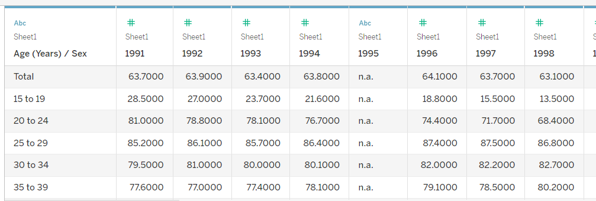

```{r setup, include=FALSE}
knitr::opts_chunk$set(echo = TRUE)
```


# Introduction 
 <font size=5pt> The data visualization below is created by using data on Resident Labour Force Participation Rate by Age and Sex provided by Ministrty of Manpower, Singapore (MOM).The data provide us basic statistical number like the resident labour force participation rate by age and sex from 1991-2021 in Singapore for audience to do further discussion and analysis. 

<p>The chart we need to revise is displayed below: 


# Critque on Clarity and Aesthetics


## Improper Title and Labeling
### Title
The title for the graph is "Labour force participation rate" that is too general to give audience a first clear impression about what the graph is about. Also reference to the basic principle for designing a statistical chart(https://isss608-ay2021-22t2.netlify.app/lesson/lesson02/lesson02-designing-graphs-to-enlighten#62), it would be more appropriate to set the title stated: "Labour force participation percentage by age in Singapore in 2005-2021".


### X-axis and y-axis label
We should avoid abbreviation for label in both x-axis and y-axis to prevent misunderstanding on our value. And we are providing percentage on y-axis,so it would be more clearly if we replace "Lfpr" with "Labour participation rate(%)" on y-axis.We could delete "Year" on every column to eliminate some redundancy on x-axis. 

##  Backgroud
The clarity is also important for a graph, as we could see from the graph the background of our graph has some light grids, which are useless for marking values. It would be better we hide those grids away for our graph. 


## Content 
### X-axis measurement
Since we are trying to show the difference of labour force participation rate between different age groups, we need to put all age group under one dimension rather than separate them and put them into different boxes. We prefer to put all age group under one common x-axis.

### Graph type
The graph is applying a histogram graph to the data, which may not provide a better comparison in labour participation rate in different group because of horizontally overlapping of different age group. It might be better if we using line chart to fully display the difference between various age groups.

## Age group
### Order
Since age is a meaningful measure in real life, we could sort and display them in ascending order instead of putting them in random order for providing better and effective to our audience.


### Color
The graph just has random different color for each age group, which is not appropriate in this scenario. We could replace the random color of each age group by another way that giving color from light to dark according to age group from "younger" to "older".

# A sketch of the improved visualization


# Building Improved Visualization through Tableau
## Data importing 
We import the data mrsd_29_Res_LFPR_28Jan2022.xlsx into the tableau and take a quick look.  We could see from the graph above that our data frame in xlsx file does work properly in tableau and we need to fix it with applying data explanation.
Then our data frame in tableau looks better! 

# New insights

## Ageing population in Singapore
The percentage of labour participating in People from older age group increases almost every year, which implies that there might be some population structure issue we need to concern about.

## Pandemic in 2020
As we could see from the above graph that percentage of labour participating in all age group in 2020 slightly decrease in 2020. It it because covid-19 make Singapore shut down for a period during 2020.


